# User Guide — BOT Biller Aggregator (BA)

**BOT:** Biller Aggregator | **Base URL:** `https://biller-dashboard-internal-playground.lentera-app.id` | **Portal:** `https://iconnet-portal-backoffice-playground.lentera-app.id` | **Version:** 1.2 | **Date:** 17-09-2026 | **Branch:** `backoffice-tools` `6c28c96` | **Tests:** 91 in 16 files `backoffice-tests/bots/ba --list`

---

## Revisi History

| Versi | Tanggal | Penulis | Perubahan |
|---|---|---|---|
| 1.0 | 28-08-2026 | QA Automation Kickstarter | Initial: probe 17 route, 91 tests, findings BA-001..006 |
| 1.1 | 17-09-2026 | QA Automation Kickstarter | Detail lengkap per menu + flowchart + sesi validasi terpisah |
| 1.2 | 17-09-2026 | QA Automation Kickstarter | Standar industri: tambah System Requirements, Install, Glossary, Roles, Safety, FAQ, Index |

---

## Daftar Isi

1. [Overview](#1-overview)
2. [Prasyarat & System Requirements](#2-prasyarat--system-requirements)
3. [Instalasi & Setup](#3-instalasi--setup)
4. [Akses & Login Flow](#4-akses--login-flow)
5. [Roles & Permissions](#5-roles--permissions)
6. [Struktur Menu](#6-struktur-menu)
7. [Flowchart Umum](#7-flowchart-umum)
8. [Detail Fitur per Menu](#8-detail-fitur-per-menu)
   - 8.1 Dashboard
   - 8.2 Bank
   - 8.3 Billing Provider
   - 8.4 Kategori & Grup
   - 8.5 Menu
   - 8.6 Mitra
   - 8.7 Mitra Sub-menu (Top Up, Riwayat, Product Pricing, Credential)
   - 8.8 Manage Product
   - 8.9 Manage Role
   - 8.10 Monitoring Transaksi
   - 8.11 Rekap Transaksi
   - 8.12 Rekonsiliasi
   - 8.13 Invoice
9. [Validasi & Negative Cases (Sesi Khusus)](#9-validasi--negative-cases-sesi-khusus)
10. [Glossary](#10-glossary)
11. [Safety & Warnings](#11-safety--warnings)
12. [FAQ](#12-faq)
13. [Data Test & Cleanup](#13-data-test--cleanup)
14. [Troubleshooting](#14-troubleshooting)
15. [Catatan Temuan](#15-catatan-temuan)
16. [Lampiran & Index](#16-lampiran--index)

---

## 1. Overview

Biller Aggregator (BA) adalah BOT backoffice untuk mengelola mitra biller, produk, transaksi, dan keuangan. Webview `biller-dashboard-internal` diakses via popup `Masuk` dari portal setelah login OTP. Semua master mengikuti pola **Search dulu → Add/Edit/Delete + validasi + cleanup**.

**Tujuan User Manual (ISO/IEC 26514:2022):** Memberikan instruksi lengkap instalasi, pengoperasian, dan pemeliharaan untuk end-user (Admin, Finance, Ops) dan QA.

**Config:** `config/local.json` `backoffice_base_url: https://iconnet-portal-backoffice-playground.lentera-app.id` `config/index.ts`

**Coverage:** 91 tests `backoffice-tests/bots/ba/*.spec.ts` — setiap master ada `validasi, add, edit, status, delete, duplikat`.

**Audience:** Admin BA, QA, Dev, Finance Ops.

---

## 2. Prasyarat & System Requirements

| Kategori | Requirement | Detail |
|---|---|---|
| Akun Portal | `subandonorogo@gmail.com` / `Password@123` | `shared/test-data/users.json:12` |
| OTP Dummy | `000000` (6 digit) | `shared/test-data/backoffice.json:login.otp_dummy` |
| Captcha | `Lakukan perintah captcha dengan benar` → klik `span` pertama | `setup/auth.setup.ts:22` |
| Workers | `1` (portal menolak 2+ login OTP bersamaan) | `playwright.config.ts:25` |
| Storage | `.auth/portal.json` via `setup` `storageState` | `playwright.config.ts:79` |
| BaseUrl BA | `https://biller-dashboard-internal-playground.lentera-app.id` | `shared/pages/BaPage.ts:17` |
| **OS** | Windows 10/11, macOS 13+, Linux Ubuntu 22.04+ | Browser Chrome 120+, Firefox 120+, WebKit 17+ |
| **Browser** | Chrome/Edge 120+ (Playwright `Desktop Chrome`) | `devices['Desktop Chrome']` `playwright.config.ts:77` |
| **Network** | 10 Mbps, port 443, akses `*.lentera-app.id` | Whitelist `iconnet-portal`, `biller-dashboard` |
| **Resolusi** | 1366x768 min, `headless:false slowMo:1000` untuk demo | `playwright.config.ts:81` |

---

## 3. Instalasi & Setup

```bash
git clone https://github.com/rogo-s/Qa-Automation-Kickstarter.git
cd Qa-Automation-Kickstarter
npm install
npx playwright install --with-deps chromium
cp .env.example .env # set TEST_ENV=local
npx playwright test --project=setup --headed # generate .auth/portal.json
npx playwright test --project=backoffice --grep @smoke --headed
npx tsx scripts/generate-pdf-report.ts # test-results/pdf/report-*.pdf
```

*Update `TEST_ENV=dev/staging` untuk `config/dev.json`.*

---

---

## 4. Akses & Login Flow

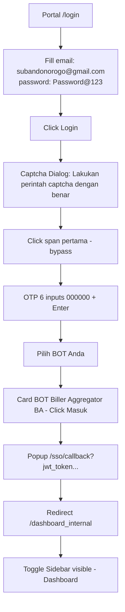
```mermaid
flowchart TD
    A[Portal /login] --> B[Fill email: subandonorogo@gmail.com<br/>password: Password@123]
    B --> C[Click Login]
    C --> D[Captcha Dialog: Lakukan perintah captcha dengan benar]
    D --> E[Click span pertama - bypass]
    E --> F[OTP 6 inputs 000000 + Enter]
    F --> G[Pilih BOT Anda]
    G --> H[Card BOT Biller Aggregator BA - Click Masuk]
    H --> I[Popup /sso/callback?jwt_token...]
    I --> J[Redirect /dashboard_internal]
    J --> K[Toggle Sidebar visible - Dashboard]
```

**Page Object:** `AdminLoginPage`, `BotSelectorPage`, `BaPage` `shared/pages/AdminLoginPage.ts`, `BotSelectorPage.ts`, `BaPage.ts`

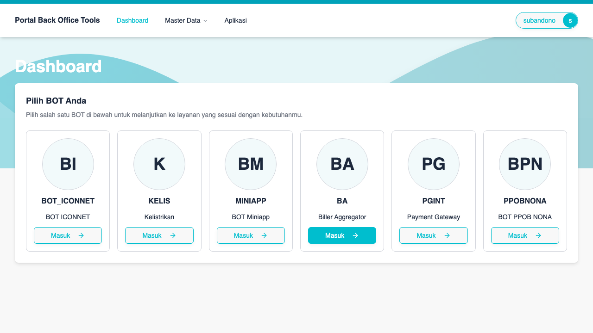

---

## 5. Roles & Permissions

| Role | Akses Menu | Catatan |
|---|---|---|
| Super Admin | Semua `Master, Transaksi, Rekonsiliasi, Invoice, Dashboard` | Hapus Menu tetap 403 `BA-003` — perlu konfirmasi dev |
| Admin Finance | `Invoice (Generate, Lunas)`, `Rekap, Rekonsiliasi` | Tidak ada `Manage Role` |
| Ops | `Monitoring, Rekap` view only | `Tambah 0 view-only` untuk beberapa master |
| Mitra | `Top Up, Riwayat` via `Mitra Sub-menu` | `BA-004 Mitra tidak punya Hapus` |

*Permission matrix 115 checkbox di `Manage Role` `BaRolePage`.*

---

## 6. Struktur Menu

Probe `a[href^="/"]` `biller-dashboard-internal` `17 route` (expand `Transaksi/Rekonsiliasi`):

| No | Parent | Menu | Route | Heading | Tipe | File Spec |
|---|---|---|---|---|---|---|
| 1 | General | Dashboard | `/dashboard_internal` | Dashboard | View | `dashboard.spec.ts` 4 tests |
| 2 | Master | Bank | `/bank_internal` | Bank | CRUD 5 | `bank.spec.ts` |
| 3 | Master | Billing Provider | `/billing_provider_internal` | Billing Provider | CRUD 6 | `billing-provider.spec.ts` |
| 4 | Master | Kategori & Grup | `/category_group_internal` | Kategori dan Grup | CRUD 10 | `category-group.spec.ts` |
| 5 | Master | Menu | `/menu_internal` | Menu | CRUD 6 (Hapus 403) | `menu.spec.ts` |
| 6 | Master | Mitra | `/mitra_internal` | Mitra | CRUD 5 (no Hapus) | `mitra.spec.ts` |
| 7 | Master | Manage Product | `/manage_product_internal` | Manage Product | CRUD 7 | `product.spec.ts` |
| 8 | Master | Manage Role | `/manage_role_internal` | Manage Role | CRUD 5 | `role.spec.ts` |
| 9 | Transaksi | Monitoring | `/monitoring_internal` | Monitoring Transaksi | View/Search/Filter/Export 4 | `monitoring.spec.ts` |
| 10 | Transaksi | Rekap | `/rekap_internal` | Rekap Transaksi | View/Filter/Export 3 | `rekap.spec.ts` |
| 11 | Rekonsiliasi | Goto | `/rekonsiliasi_goto_internal` | Rekonsiliasi Goto | View/Search 5 | `rekonsiliasi.spec.ts` |
| 12 | Rekonsiliasi | Kudo | `/rekonsiliasi_kudo_internal` | Rekonsiliasi Kudo | View | `rekonsiliasi.spec.ts` |
| 13 | Rekonsiliasi | E2Pay | `/rekonsiliasi_e2pay_internal` | Rekonsiliasi E2Pay | View | `rekonsiliasi.spec.ts` |
| 14 | Rekonsiliasi | AyoConnect | `/rekonsiliasi_ayoconnect_internal` | Rekonsiliasi AyoConnect | View | `rekonsiliasi.spec.ts` |
| 15 | Invoice | Invoice | `/invoice_internal` | Invoice | Generate/Lunas/Print 5 | `invoice.spec.ts` |
| 16 | Sub-menu Mitra | Top Up | `/mitra_internal/topup/<id>` | Top Up | 9 tests | `mitra-submenu.spec.ts` |
| 17 | Sub-menu Mitra | Product Pricing | `/mitra_internal/product-pricing/<id>` | Product Pricing | Generate/Price | `mitra-submenu.spec.ts` |

---

## 7. Flowchart Umum

### 5.1 Master CRUD (Bank, Billing Provider, Kategori, Menu, Role, Product)

```mermaid
flowchart TD
    A[Master List] --> B[Search: hasRow(code)?]
    B -->|Tidak ada| C[openAdd → fill code/name → save]
    B -->|Ada| D[hasRow true]
    C --> E[hasRow true → row contain code]
    E --> F[Open menu Ubah → fill name !@# → cek Simpan disabled? → revert → fill QA EDIT → save]
    F --> G[Search kode duplikat → fill code existing → save → expect toast Kode sudah digunakan]
    G --> H[Open menu Hapus → Lanjutkan → hasRow false → cleanup]
    H --> I[Search ZZZ_NOT_EXIST_999 → 0 rows Tidak ada data]
```

### 5.2 Mitra (tanpa Hapus)

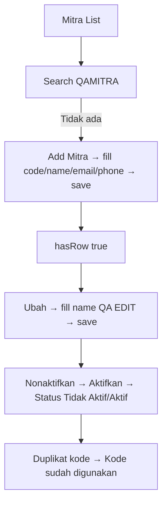
```mermaid
flowchart TD
    A[Mitra List] --> B[Search QAMITRA]
    B -->|Tidak ada| C[Add Mitra → fill code/name/email/phone → save]
    C --> D[hasRow true]
    D --> E[Ubah → fill name QA EDIT → save]
    E --> F[Nonaktifkan → Aktifkan → Status Tidak Aktif/Aktif]
    F --> G[Duplikat kode → Kode sudah digunakan]
```

### 5.3 Mitra Sub-menu Top Up

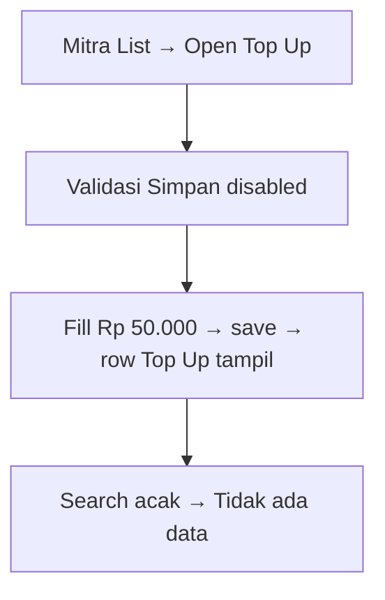
```mermaid
flowchart TD
    A[Mitra List → Open Top Up] --> B[Validasi Simpan disabled]
    B --> C[Fill Rp 50.000 → save → row Top Up tampil]
    C --> D[Search acak → Tidak ada data]
```

### 5.4 Monitoring

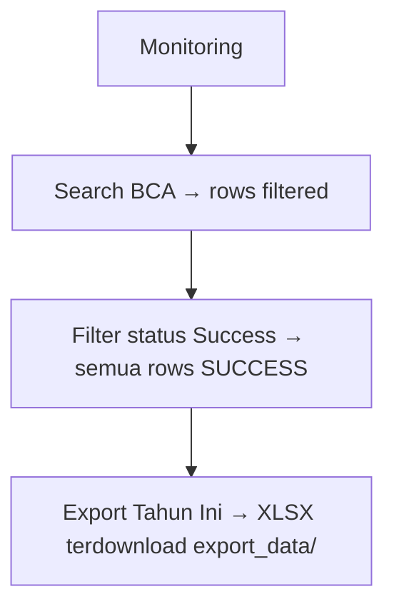
```mermaid
flowchart TD
    A[Monitoring] --> B[Search BCA → rows filtered]
    B --> C[Filter status Success → semua rows SUCCESS]
    C --> D[Export Tahun Ini → XLSX terdownload export_data/]
```

---

## 8. Detail Fitur per Menu

### 8.1 Dashboard

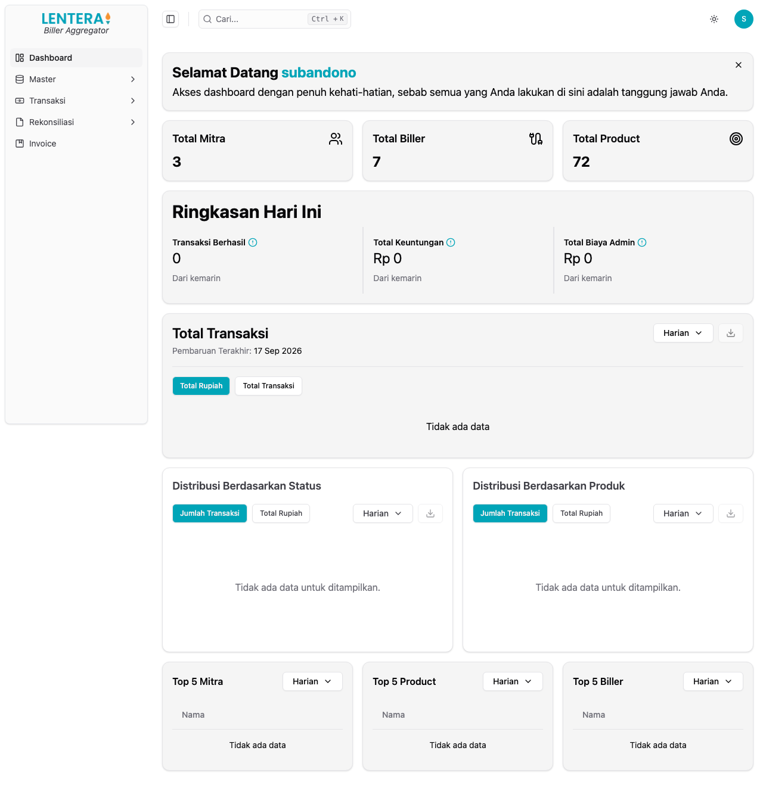

* **Route:** `/dashboard_internal` `DashboardPage` `BaPage`
* **Fungsi:** Menampilkan `Total Mitra 3, Biller 7, Product 71`, `Ringkasan Hari Ini` `Transaksi Berhasil`, `Distribusi Status/Produk`, `Top 5 Mitra/Product/Biller`
* **Input Testcase:**
  | Field | Input | Expected |
  |---|---|---|
  | Toggle Total Transaksi | Click `Total Transaksi` | `shadow-sm` class |
  | Dropdown Periode | Pilih `Bulanan` → `Harian` | `Bulanan` visible → `Harian` visible |
  | Legend | `SUCCESS/FAILED/PROCESS/EXPIRED` | Visible |
* **Flow:**

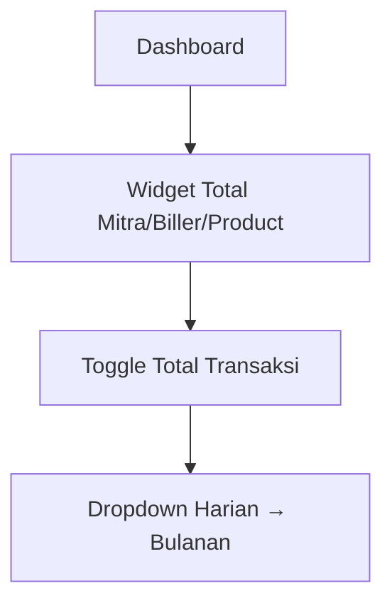
```mermaid
flowchart TD
    A[Dashboard] --> B[Widget Total Mitra/Biller/Product]
    B --> C[Toggle Total Transaksi]
    C --> D[Dropdown Harian → Bulanan]
```

### 8.2 Bank

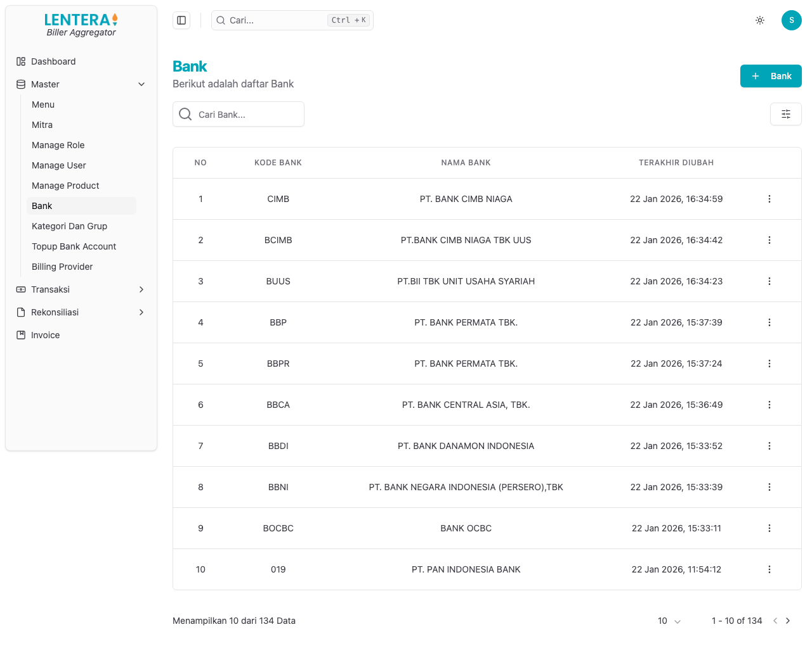

* **Route:** `/bank_internal` `BaBankPage` `heading Bank`
* **Fungsi:** Mengelola master bank untuk settlement
* **Field:** `name:Bank Tes` `code:TES` `shortName:TES` `swiftCode:TES123` `input[name]` `Cari Bank...`
* **Menu Row:** `Ubah | Hapus` → `Lanjutkan` `duplikat Kode sudah digunakan`
* **Flow:**

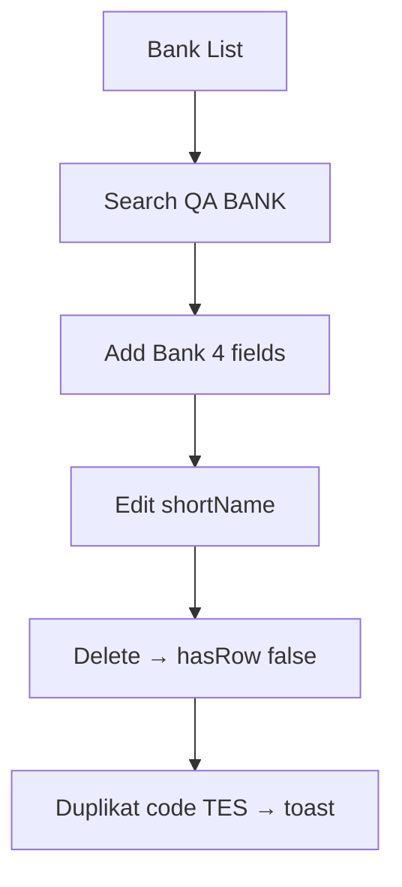
```mermaid
flowchart TD
    A[Bank List] --> B[Search QA BANK]
    B --> C[Add Bank 4 fields]
    C --> D[Edit shortName]
    D --> E[Delete → hasRow false]
    E --> F[Duplikat code TES → toast]
```

* **Testcase Input:**

| Test | Input | Expected |
|---|---|---|
| Validasi | `name` saja | `Simpan disabled true` |
| Add | `name=QA BANK xxx, code=TESXXX, shortName=TES, swiftCode=TES123` | `row QA BANK` |
| Edit | `shortName=TESTX` | `row TESTX` |
| Delete | `Hapus → Lanjutkan` | `hasRow false` |
| Duplikat | `code=TES existing` | `toast Kode sudah digunakan` |

### 8.3 Billing Provider

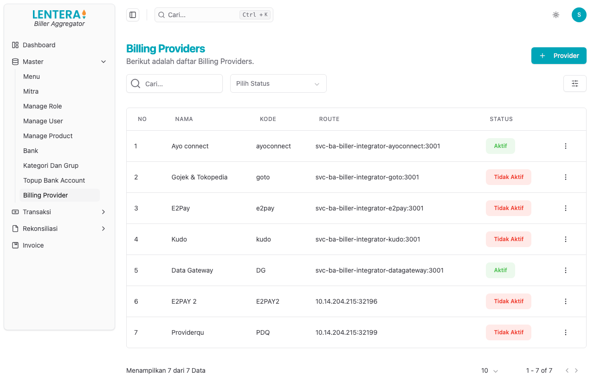

* **Route:** `/billing_provider_internal` `BaBillingProviderPage`
* **Fungsi:** Mengelola provider biller
* **Field:** `code, name, ...`
* **Testcase:** sama Bank `validasi, add, edit, status, delete, duplikat`

### 8.4 Kategori & Grup

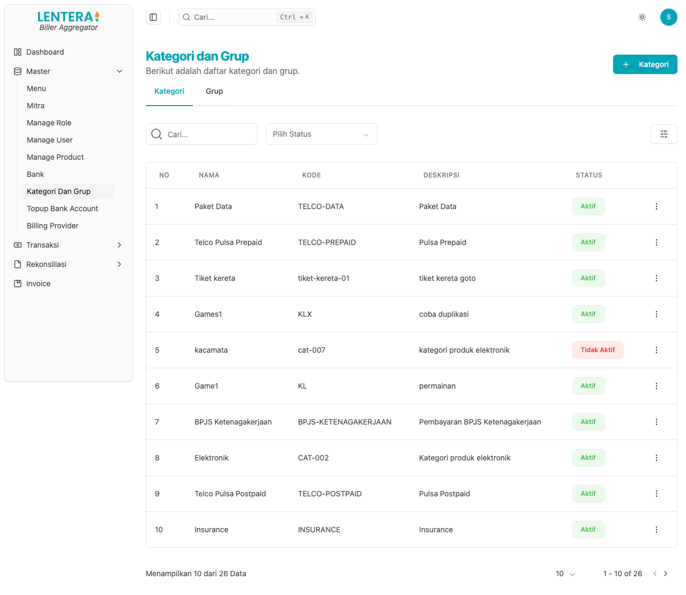

* **Route:** `/category_group_internal` `BaCategoryGroupPage`
* **Fungsi:** Kategori `code, name` dan Grup `code, name, kategori`
* **Testcase:** Kategori 6 tests + Grup 4 tests `validasi, add, edit, status, delete, duplikat` — duplikat `Kode Kategori sudah digunakan`

### 8.5 Menu

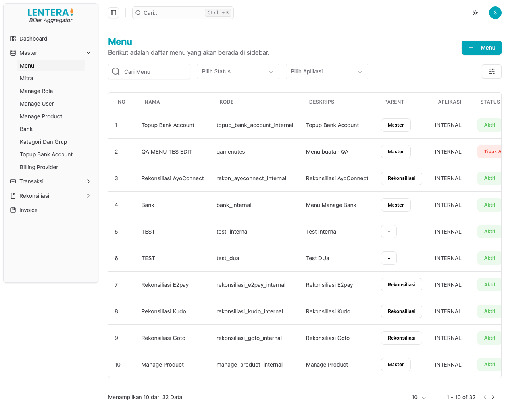

* **Route:** `/menu_internal` `BaMenuPage`
* **Fungsi:** Menu sidebar `code, name, icon, parent, description, status, permission`
* **Field Detail:**

| Field | Placeholder | Validasi |
|---|---|---|
| code | `Masukan kode` | required, duplikat → `Kode sudah digunakan` |
| name | `Masukan nama` | required |
| icon | `Masukan icon` | `lucide-*` |
| parent | `Pilih parent menu` | dropdown |
| Hapus | `DELETE /api/v1/master/menu/delete` | `403 Anda tidak memiliki izin` `BA-003` |

* **Flow:**

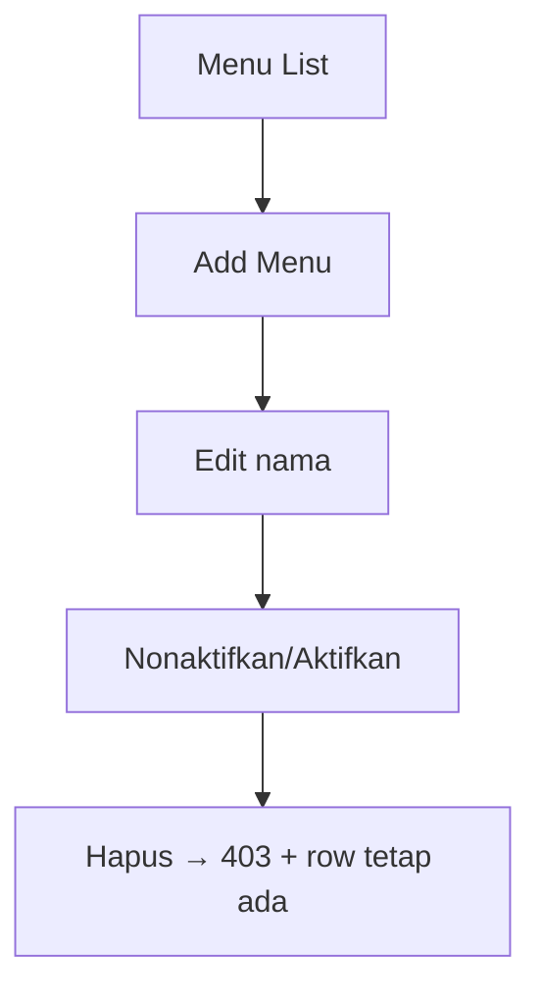
```mermaid
flowchart TD
    A[Menu List] --> B[Add Menu]
    B --> C[Edit nama]
    C --> D[Nonaktifkan/Aktifkan]
    D --> E[Hapus → 403 + row tetap ada]
```

### 8.6 Mitra

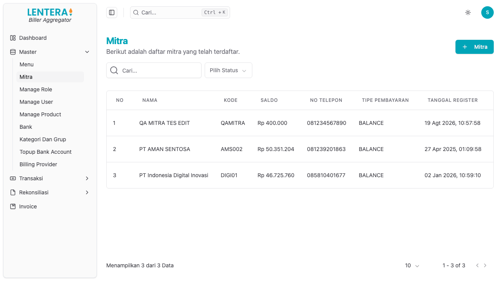

* **Route:** `/mitra_internal` `BaMitraPage`
* **Fungsi:** Mitra biller
* **Field:** `code, name, email, phone, address, pic`
* **Keterangan:** `Tidak punya Hapus` `BA-004` — hanya `Aktifkan/Nonaktifkan`
* **Duplikat:** `Kode sudah digunakan`

### 8.7 Mitra Sub-menu

* **Route:** `/mitra_internal/topup/<id>` `BaMitraSubMenuPage`
* **Fungsi:** Top Up `validasi → Rp 50.000 → tabel`, Riwayat, Product Pricing `Generate`, Credential, Price dialog `Simpan disabled sampai form terisi`
* **Input:** `Top Up Rp 50.000`, `Generate Product Pricing`

### 8.8 Manage Product

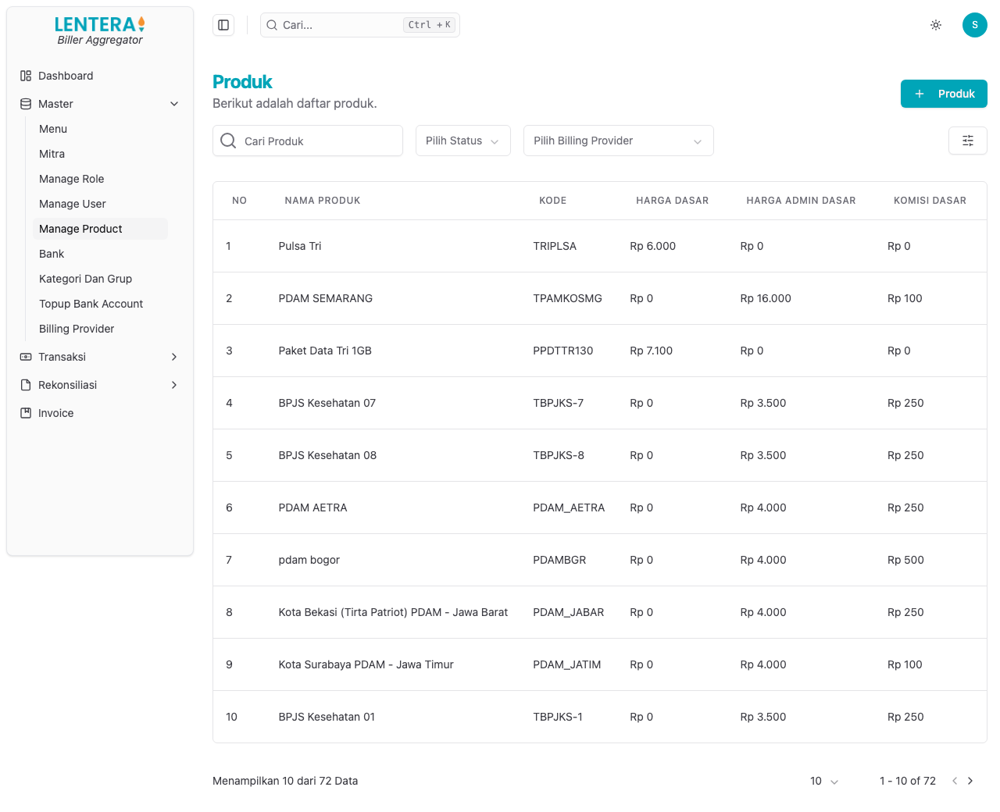

* **Route:** `/manage_product_internal` `BaProductPage`
* **Fungsi:** Produk biller
* **Field:** `code, name, Biaya Admin/Komisi` `AdminFee, CommissionFee tidak boleh kosong` `BA` | `type BILLING → Harga disabled` `BA-006`
* **Flow:** `validasi tanpa Biaya → error → add dengan Biaya → edit → status → delete → duplikat Kode produk sudah digunakan`

### 8.9 Manage Role

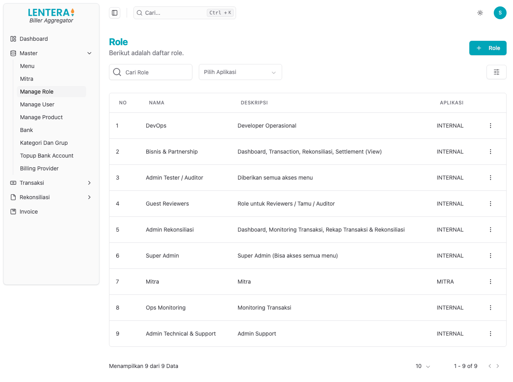

* **Route:** `/manage_role_internal` `BaRolePage`
* **Fungsi:** Role `code, name, permission matrix` `minimal memiliki satu akses menu` `BA-005` `500 Nama role sudah digunakan`
* **Field:** `permission` checkbox `Dashboard/View` 115 checkbox

### 8.10 Monitoring Transaksi

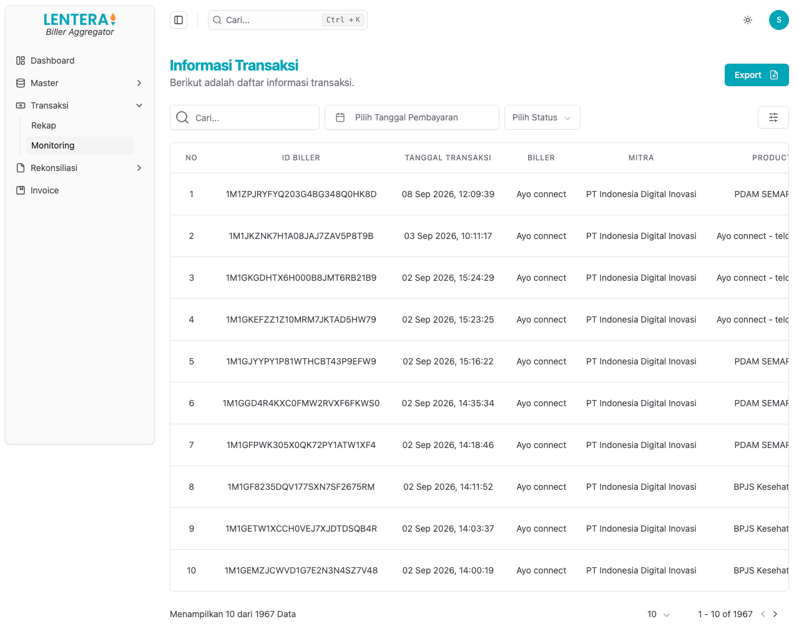

* **Route:** `/monitoring_internal` `BaTransaksiPage`
* **Fungsi:** Daftar transaksi `Search, Filter status Success, Export XLSX Tahun Ini`

### 8.11 Rekap Transaksi

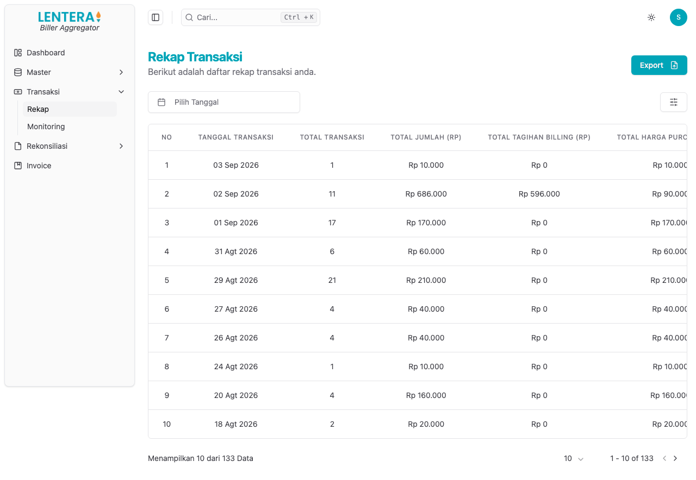

* **Route:** `/rekap_internal`
* **Fungsi:** `Filter Tahun Ini, Export XLSX`

### 8.12 Rekonsiliasi

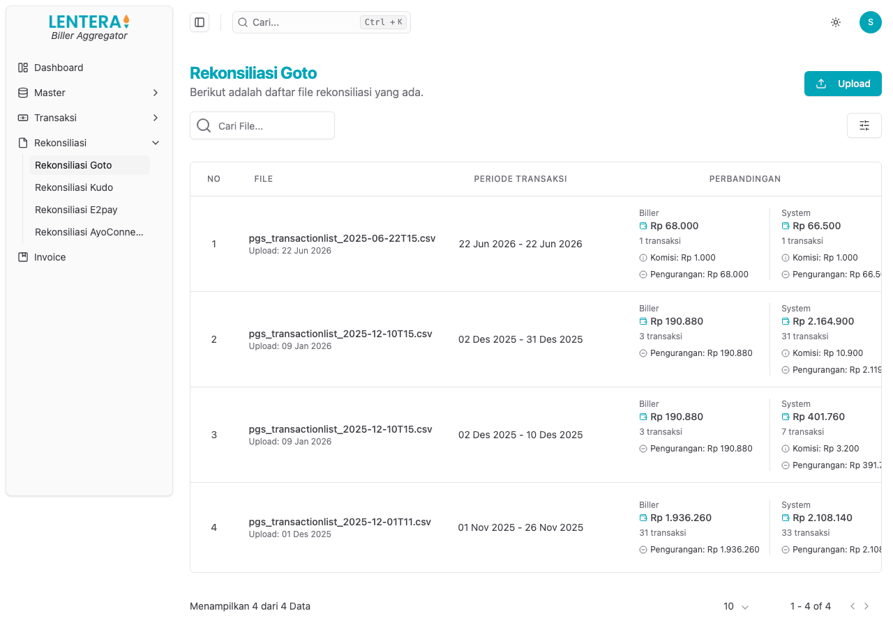

* **Route:** `/rekonsiliasi_goto_internal`, `/rekonsiliasi_kudo_internal`, `/rekonsiliasi_e2pay_internal`, `/rekonsiliasi_ayoconnect_internal`
* **Fungsi:** Tabel perbandingan `Upload Files`, `Search Cari File`

### 8.13 Invoice

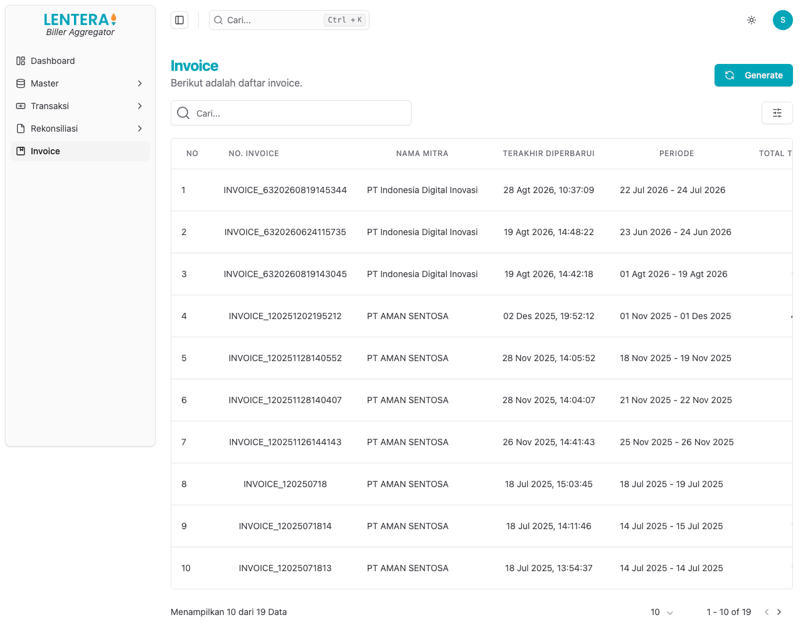

* **Route:** `/invoice_internal` `BaInvoicePage`
* **Fungsi:** `Generate` `mitra DIGI01, range bulan berjalan` → `invoice baru ATAU ditolak overlap`, `Konfirmasi Pembayaran: Belum Lunas → Lunas`, `Print`

---

## 9. Validasi & Negative Cases (Sesi Khusus)

| No | Menu | Field | Input Invalid | Expected | Actual | Status | File |
|---|---|---|---|---|---|---|---|
| 1 | Bank | code | `!@#` | Simpan disabled |  |  | `bank.spec.ts:1` |
| 2 | Bank | code duplikat | `TES` existing | toast `Kode sudah digunakan` |  |  | `bank.spec.ts:5` |
| 3 | Menu | Hapus | `Hapus` | `403 Anda tidak memiliki izin` + row tetap |  |  | `menu.spec.ts:5` `BA-003` |
| 4 | Mitra | code duplikat | `QAMITRA existing` | `Kode sudah digunakan` |  |  | `mitra.spec.ts:5` |
| 5 | Product | Biaya Admin | `0` | `AdminFee, CommissionFee tidak boleh kosong` |  |  | `product.spec.ts:2` |
| 6 | Role | permission | `0 checkbox` | `minimal memiliki satu akses menu` |  |  | `role.spec.ts:2` |
| 7 | Role | name duplikat | `existing` | `500 Nama role sudah digunakan` |  |  | `role.spec.ts:6` `BA-005` |
| 8 | Search | keyword acak | `ZZZ_NOT_EXIST_999` | `0 rows / Tidak ada data` |  |  | `monitoring.spec.ts:2` |
| 9 | Kategori | code duplikat | `existing` | `Kode Kategori sudah digunakan` |  |  | `category-group.spec.ts:6,10` |
| 10 | Mitra Top Up | amount | `""` | `Simpan disabled` |  |  | `mitra-submenu.spec.ts:1` |

*Isi Actual saat retest.*

---

## 10. Glossary

| Istilah | Definisi |
|---|---|
| Biller | Penyedia tagihan (PLN, PDAM, Telkom) yang di-aggregasi |
| Mitra | Partner yang menjual produk biller ke end-user |
| PSP | Payment Service Provider — mitra pembayaran |
| Rekonsiliasi | Pencocokan transaksi BA vs Biller (Goto, Kudo, E2Pay, AyoConnect) |
| Invoice | Tagihan mitra per periode, status Belum Lunas → Lunas |
| Top Up | Penambahan saldo mitra `Rp 50.000` |
| Product Pricing | Harga produk per mitra, Generate |
| OTP | One-Time Password 6 digit `000000` dummy |
| 403 | Forbidden — tidak punya izin hapus Menu |
| XLSX | Excel export `export_data/` |

---

## 11. Safety & Warnings

| Warning | Detail | Mitigasi |
|---|---|---|
| Hapus Menu 403 | `DELETE /api/v1/master/menu/delete` selalu 403 `BA-003` | Jangan hapus Menu di prod; hubungi dev |
| Duplikat Kode | `Kode sudah digunakan` toast | Gunakan `QA*+uniq` `Date.now()` |
| Rate Limit OTP | OTP `000000` dibatasi, jangan >3x salah | Test OTP salah max 1x `prepaid.spec.ts:2` |
| Data Sampah | Semua `ADD` harus `delete` | `hasRow ? delete → hasRow false` |

---

## 12. FAQ

| Q | A |
|---|---|
| Login gagal `Email atau password salah`? | Cek `subandonorogo@gmail.com` `shared/test-data/users.json` dan `TEST_ENV` |
| Captcha tidak hilang? | Tunggu `skeleton` hidden `setup/auth.webview-nona.setup.ts:32` + `force click span` |
| Search Bank selalu Tidak ada data? | `BA-001` known bug, pakai scan tabel tanpa filter |
| Export XLSX dimana? | `backoffice-tests/bots/ba/export_data/` `BaTransaksiPage` |
| PDF report dimana? | `test-results/pdf/report-*.pdf` `scripts/generate-pdf-report.ts` |

---

## 13. Data Test & Cleanup

* **Uniq:** `Date.now().slice(-6)` `QA BANK <uniq>` `QAPSP` `QAUSER` `QAMITRA`
* **Pola ADD:** `hasRow(code) ? skip add : openAdd → fill → save → hasRow true` `BaBankPage:hasRow`
* **Cleanup:** `hasRow ? deleteBank/code → Lanjutkan → hasRow false` `deleteBank:125` `BaBankPage` — semua `ADD` langsung `delete` biar tidak sampah `backoffice-tests/bots/ba/*.spec.ts`
* **Search:** `Cari Bank...` `input#search` `fill → wait 1500ms`

---

## 14. Troubleshooting

| Issue | Detail | File |
|---|---|---|
| `Tambah 0 view-only` | Role `subandonorogo` tidak ada `Tambah` untuk beberapa master — skip ADD, cek Edit | `MiniappMasterPage.ts` |
| `404 017` | Route tidak ada `master/017` — skip | `probe` |
| `Workers 1` | Portal menolak 2+ login OTP bersamaan | `playwright.config.ts:25` |
| `ERR_CONNECTION_REFUSED` | `NONA-005` transien, retry lulus | `findings.ts` |
| `Hapus Menu 403` | By-design atau bug permission | `BA-003` |

---

## 15. Catatan Temuan

`shared/pdf/findings.ts` `BA-001..006, NONA-001..011`

| ID | Status | Title | URL |
|---|---|---|---|
| BA-001 | OPEN | Pencarian Master Bank selalu Tidak ada data | `/bank_internal` |
| BA-002 | OPEN | Dialog hapus Bank menyebut provider | `/bank_internal, /topup_bank_account_internal` |
| BA-003 | OPEN | Hapus Menu 403 Anda tidak memiliki izin | `/menu_internal` |
| BA-004 | INFO | Mitra tidak punya Hapus | `/mitra_internal` |
| BA-005 | OPEN | Duplikat Role 500 | `/manage_role_internal/add` |
| BA-006 | INFO | Picker Pilih product me-disable yang sudah pricing | `/mitra_internal/product-pricing` |

---

## 16. Lampiran & Index

### 16.1 Index

| Keyword | Halaman |
|---|---|
| Bank | 8.2 |
| Invoice | 8.13 |
| Login | 4 |
| Mitra Top Up | 8.7 |
| Role | 8.9 |

### 16.2 Lampiran

* **Jumlah Test:** `91 tests in 16 files` `npx playwright test backoffice-tests/bots/ba --list`
* **File Spec:** `backoffice-tests/bots/ba/*.spec.ts` `bank 5, billing-provider 6, category-group 10, dashboard 4, entry 1, invoice 5, menu 6, mitra 5, mitra-submenu 9, monitoring 4, product 7, rekap 3, rekonsiliasi 5, role 5, topup`
* **Page Object:** `shared/pages/Ba*Page.ts` `BaBankPage, BaBillingProviderPage, BaCategoryGroupPage, BaMenuPage, BaMitraPage, BaMitraSubMenuPage, BaProductPage, BaRolePage, BaTransaksiPage, BaUserPage, BaPage`
* **Report PDF:** `test-results/pdf/report-*.pdf` `npx tsx scripts/generate-pdf-report.ts` `shared/pdf/template.ts` `aggregate.ts`

---

## 17. Kontak

QA Automation Kickstarter `subandonorogo@gmail.com` `https://github.com/rogo-s/Qa-Automation-Kickstarter` `branch backoffice-tools` `6c28c96`
