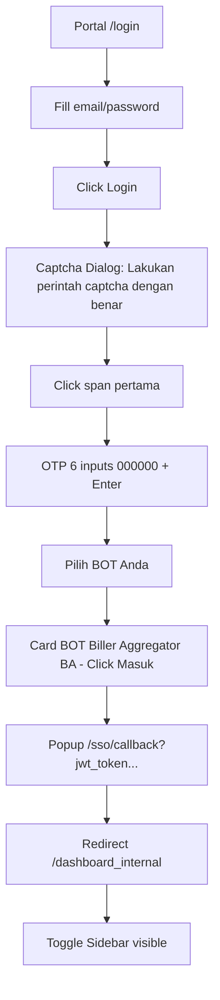
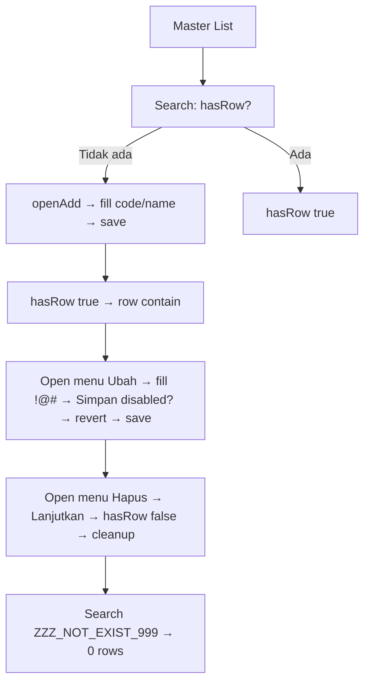
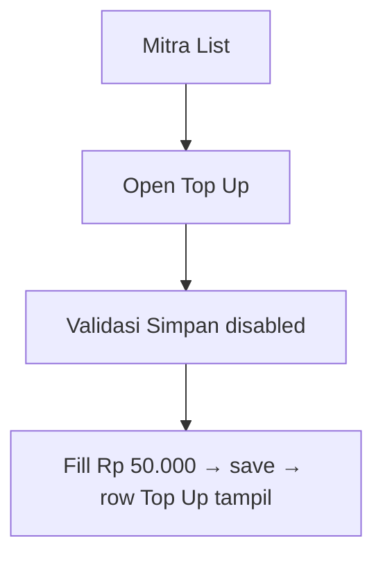
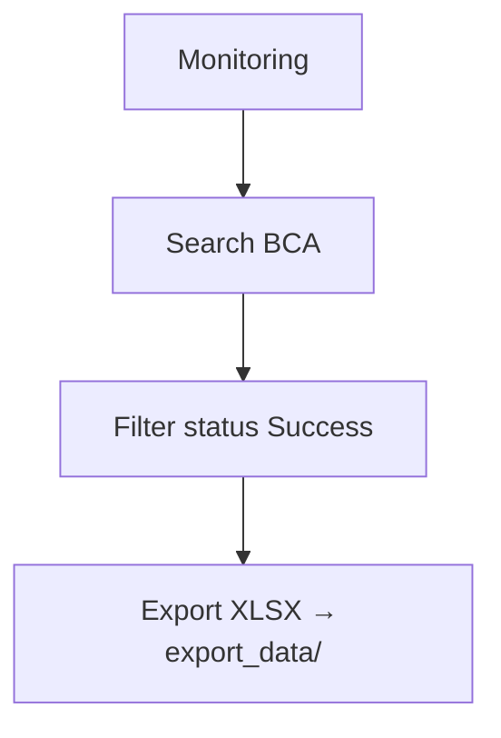

# User Guide — BOT Biller Aggregator (BA)

**BOT:** Biller Aggregator | **Base URL:** `https://biller-dashboard-internal-playground.lentera-app.id` | **Portal:** `https://iconnet-portal-backoffice-playground.lentera-app.id` | **Version:** 1.0 | **Date:** 28-08-2026 | **Branch:** `backoffice-tools` `6c28c96` | **Tests:** 91 in 16 files `backoffice-tests/bots/ba --list`

---

## Revisi History

| Versi | Tanggal | Penulis | Perubahan |
|---|---|---|---|
| 1.0 | 28-08-2026 | QA Automation Kickstarter | Initial: probe 17 route, 91 tests, findings BA-001..006 |

---

## Daftar Isi

1. [Overview](#1-overview)
2. [Prasyarat](#2-prasyarat)
3. [Akses & Login Flow](#3-akses--login-flow)
4. [Struktur Menu](#4-struktur-menu)
5. [Flowchart Umum](#5-flowchart-umum)
6. [Panduan per Menu](#6-panduan-per-menu)
7. [Validasi & Negative Cases](#7-validasi--negative-cases)
8. [Data Test & Cleanup](#8-data-test--cleanup)
9. [Troubleshooting](#9-troubleshooting)
10. [Catatan Temuan](#10-catatan-temuan)
11. [Lampiran](#11-lampiran)

---

## 1. Overview

Biller Aggregator (BA) mengelola Bank, Billing Provider, Kategori & Grup, Menu, Mitra & sub-menu (Top Up, Riwayat, Product Pricing, Credential), Manage Product, Role, Monitoring, Rekap, Rekonsiliasi, Invoice, Dashboard. Semua via webview `biller-dashboard-internal` setelah `Masuk` dari portal.

**Config:** `config/local.json` `backoffice_base_url: https://iconnet-portal-backoffice-playground.lentera-app.id` `config/index.ts`

---

## 2. Prasyarat

| Item | Value |
|---|---|
| Akun Portal | `subandonorogo@gmail.com` / `Password@123` `shared/test-data/users.json:12` |
| OTP | `000000` `shared/test-data/backoffice.json:login.otp_dummy` |
| Captcha | `Lakukan perintah captcha dengan benar` → klik `span` pertama `setup/auth.setup.ts:22` |
| Workers | `1` `playwright.config.ts:25` (portal menolak 2+ login OTP bersamaan) |
| Storage | `.auth/portal.json` via `setup` `storageState` |

---

## 3. Akses & Login Flow

**Page Object:** `AdminLoginPage`, `BotSelectorPage` `shared/pages/AdminLoginPage.ts`, `BotSelectorPage.ts`

---

## 4. Struktur Menu

Probe `a[href^="/"]` `biller-dashboard-internal` `17 route` (expand `Transaksi/Rekonsiliasi`):

| No | Parent | Menu | Route | Heading | Tipe |
|---|---|---|---|---|---|
| 1 | General | Dashboard | `/dashboard_internal` | Dashboard | View |
| 2 | Master | Bank | `/bank_internal` | Bank | CRUD 5 |
| 3 | Master | Billing Provider | `/billing_provider_internal` | Billing Provider | CRUD 6 |
| 4 | Master | Kategori & Grup | `/category_group_internal` | Kategori dan Grup | CRUD 10 |
| 5 | Master | Menu | `/menu_internal` | Menu | CRUD 6 (Hapus 403) |
| 6 | Master | Mitra | `/mitra_internal` | Mitra | CRUD 5 (no Hapus) |
| 7 | Master | Manage Product | `/manage_product_internal` | Manage Product | CRUD 7 |
| 8 | Master | Manage Role | `/manage_role_internal` | Manage Role | CRUD 5 |
| 9 | Transaksi | Monitoring | `/monitoring_internal` | Monitoring Transaksi | View/Search/Filter/Export 4 |
| 10 | Transaksi | Rekap | `/rekap_internal` | Rekap Transaksi | View/Filter/Export 3 |
| 11 | Rekonsiliasi | Goto | `/rekonsiliasi_goto_internal` | Rekonsiliasi Goto | View/Search 5 |
| 12 | Invoice | Invoice | `/invoice_internal` | Invoice | Generate/Lunas/Print 5 |
| 13 | Sub-menu Mitra | Top Up, Riwayat, Product Pricing, Credential | `/mitra_internal/product-pricing/<id>` etc. | — | 9 |

*Kolom Expected/Actual kosong — isi manual saat retest.*

---

## 5. Flowchart Umum

### 5.1 Master CRUD

### 5.2 Mitra Top Up

### 5.3 Monitoring

---

## 6. Panduan per Menu

### 6.1 Dashboard

* **Route:** `/dashboard_internal` `DashboardPage`
* **View:** `Total Mitra 3, Biller 7, Product 71`, `Ringkasan Hari Ini`, `Distribusi Status/Produk`, `Top 5 Mitra/Product/Biller`
* **Toggle:** `Total Transaksi` `shadow-sm/text-warning` `BaPage`
* **Periode:** Dropdown `Harian → Bulanan → Harian`

| Test | Langkah | Expected | Actual | Status |
|---|---|---|---|---|
| 1. Buka dashboard | `openDashboard` | Widget tampil | | |
| 2. Toggle Total Transaksi | `toggleButton Total Transaksi click` | `shadow-sm` | | |
| 3. Dropdown Bulanan | `pickPeriode Bulanan` | `Bulanan` visible | | |
| 4. Legend SUCCESS/FAILED/PROCESS/EXPIRED | `getByText` | Visible | | |

### 6.2 Bank (5 tests)

* **Route:** `/bank_internal` `BaBankPage`
* **Fields:** `name:Bank Tes, code:TES, shortName:TES, swiftCode:TES123`
* **Search:** `Cari Bank...` `input#search`
* **Menu:** `Ubah / Hapus` → `Lanjutkan` `duplikat Kode sudah digunakan`

| Test | Langkah | Expected | Actual |
|---|---|---|---|
| 1 Validasi | `openAdd → fill name saja → Simpan disabled true` | disabled | |
| 2 Add | `search QA BANK xxx → tidak ada → fill 4 fields → save → hasRow` | row `QA BANK` | |
| 3 Edit | `openEdit → ganti shortName → save → row` | `TESTX` | |
| 4 Delete | `deleteBank → hasRow false` | hilang | |
| 5 Duplikat | `ADD kode TES → toast Kode sudah digunakan` | toast | |

*Cleanup: test 4/5 hapus dummy.*

### 6.3 Billing Provider (6 tests)

* **Fields:** `code, name, ...`
* **Validasi, Add, Edit, Status, Delete, Duplikat** — sama Bank.

### 6.4 Kategori & Grup (10 tests)

* **Kategori:** `code, name` `Tambah Kategori` `duplikat`
* **Grup:** `code, name, kategori` `Tambah Grup`

### 6.5 Menu (6 tests)

* **Fields:** `code, name, icon, parent, description, status, permission`
* **Hapus 403** `BA-003` `DELETE /api/v1/master/menu/delete 403 Anda tidak memiliki izin` — verifikasi `403` + row tetap ada

### 6.6 Mitra (5 tests)

* **Fields:** `code, name, email, phone, address, pic` `Mitra tidak punya Hapus` `BA-004` — hanya `Aktifkan/Nonaktifkan`
* **Duplikat:** `Kode sudah digunakan`

### 6.7 Mitra Sub-menu (9 tests)

* **Top Up:** `validasi → topup Rp 50.000 → tabel` `BaMitraSubMenuPage`
* **Riwayat, Product Pricing, Credential, Price dialog, Generate**

### 6.8 Manage Product (7 tests)

* **Fields:** `code, name, Biaya Admin/Komisi` `AdminFee tidak boleh kosong`
* **Duplikat:** `Kode produk sudah digunakan`

### 6.9 Manage Role (5 tests)

* **Fields:** `code, name, permission matrix` `minimal memiliki satu akses menu`
* **Duplikat:** `500 Nama role sudah digunakan` `BA-005`

### 6.10 Monitoring (4 tests)

* **Search, Filter status Success, Export XLSX** `export_data/`

### 6.11 Rekap (3 tests)

* **Filter Tahun Ini, Export**

### 6.12 Rekonsiliasi (5 tests)

* **Goto, Kudo, E2Pay, AyoConnect, Search**

### 6.13 Invoice (5 tests)

* **Generate (mitra DIGI01, range bulan), Konfirmasi Lunas, Print**

---

## 7. Validasi & Negative Cases

| Field | Input Invalid | Expected | Actual | Status |
|---|---|---|---|---|
| Bank code | `!@#` | Simpan disabled | | |
| Bank code duplikat | `TES` existing | toast Kode sudah digunakan | | |
| Menu Hapus | `Hapus` | 403 Anda tidak memiliki izin | | |
| Role tanpa permission | `0 checkbox` | error minimal memiliki satu akses | | |
| Product tanpa Biaya | `0` | AdminFee tidak boleh kosong | | |
| Search tidak ada | `ZZZ_NOT_EXIST_999` | 0 rows / Tidak ada data | | |

---

## 8. Data Test & Cleanup

* **Uniq:** `Date.now().slice(-6)` `QA BANK <uniq>` `QAPSP` `QAUSER`
* **Pola:** `hasRow(code) ? skip add : openAdd → fill → save → hasRow true` `hasRow` + `deleteBank/code` `Lanjutkan` → `hasRow false` biar tidak sampah `backoffice-tests/bots/ba/*.spec.ts`

---

## 9. Troubleshooting

| Issue | Detail |
|---|---|
| `Tambah 0 view-only` | Role `subandonorogo` tidak ada `Tambah` untuk beberapa master — skip ADD, cek Edit |
| `404 017` | Route tidak ada `master/017` — skip |
| `Workers 1` | Portal menolak 2+ login OTP bersamaan — `playwright.config.ts:25` |
| `ERR_CONNECTION_REFUSED` | `NONA-005` transien, retry lulus |

---

## 10. Catatan Temuan

`shared/pdf/findings.ts` `BA-001..006, NONA-001..011`

| ID | Status | Title | URL |
|---|---|---|---|
| BA-001 | OPEN | Pencarian Master Bank selalu Tidak ada data | `/bank_internal` |
| BA-002 | OPEN | Dialog hapus Bank menyebut provider | `/bank_internal, /topup_bank_account_internal` |
| BA-003 | OPEN | Hapus Menu 403 Anda tidak memiliki izin | `/menu_internal` |
| BA-004 | INFO | Mitra tidak punya Hapus | `/mitra_internal` |
| BA-005 | OPEN | Duplikat Role 500 | `/manage_role_internal/add` |
| BA-006 | INFO | Picker Pilih product me-disable yang sudah pricing | `/mitra_internal/product-pricing` |

---

## 11. Lampiran

* **Jumlah Test:** `91 tests in 16 files` `npx playwright test backoffice-tests/bots/ba --list`
* **File Spec:** `backoffice-tests/bots/ba/*.spec.ts` `bank, billing-provider, category-group, dashboard, entry, invoice, menu, mitra, mitra-submenu, monitoring, product, rekap, rekonsiliasi, role, topup`
* **Page Object:** `shared/pages/Ba*Page.ts` `BaBankPage, BaBillingProviderPage, BaCategoryGroupPage, BaMenuPage, BaMitraPage, BaMitraSubMenuPage, BaProductPage, BaRolePage, BaTransaksiPage, BaUserPage`
* **Report PDF:** `test-results/pdf/report-*.pdf` `npx tsx scripts/generate-pdf-report.ts`

---

## 12. Kontak

QA Automation Kickstarter `subandonorogo@gmail.com` `https://github.com/rogo-s/Qa-Automation-Kickstarter` `branch backoffice-tools`
